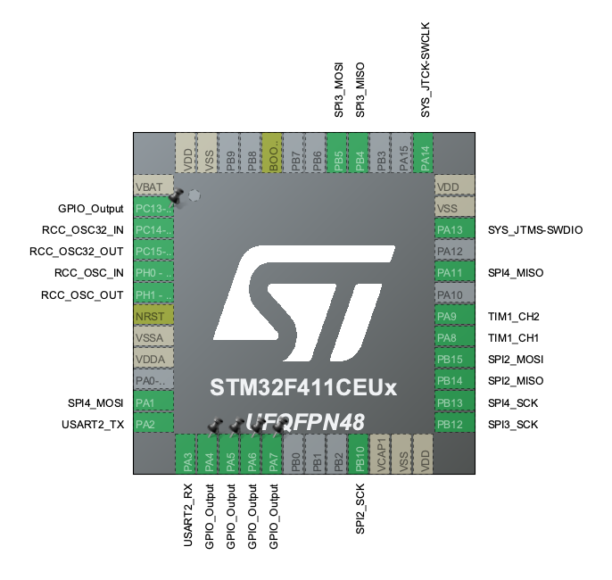

# Payload Core

Firmware for the rocket payload flight controller, responsible for fin actuation, flight data acquisition and logging.

## System Overview

The payload core can be run on the STM32F411Xe family of microcontrollers, though the configuration is designed for the smaller STM32F411CE variant, found on the blackpill.

The pin assignments, and system interface assignments are as follows:

| Component | Model | Interface | Description | Pins |
|-----------|-------|-----------|-------------|------|
| Fin Servos 1/2 | FS5106B-FB | PWM (TIM1_CH1/2) | Active fin control | CH1(PA8), CH2(PA9)
| - | - | SPI1 | Reserved interface for future use | SCK(PA5), MISO(PA6), MOSI(PA7)
| SD Card | - | SPI2 | Flight data logging | SCK(PB10), MISO(PB14), MOSI(PB15)
| Altimeter | BMP388 | SPI3 | Barometric pressure/altitude sensing | SCK(PB12), MISO(PB4), MOSI(PB5)
| IMU | LSM9DS1 | SPI4 | 9-DOF inertial measurement | SCK(PB13), MISO(PA11), MOSI(PA1)
| - | - | UART2 | Serial output | TX(PA2), RX(PA3)
| - | - | RCC | Reserved, currently unenabled pins for LSE/HSE | OSC32_IN(PC14), OSC32_OUT(PC15), OSC_IN(PH0), OSC_OUT(PH1)
| - | - | SWD | Serial Wire Debug port | SWCLK(PA14), SWDIO(PA13)


The pin configuration is set up as follows:



Additionally, for the pins setup as GPIO output, the definitions are as follows:
| Pin | Peripheral |
|-----|------------|
| PB2 | SPI1 CS |
| PA4 | SPI2 CS |
| PB0 | SPI3 CS |
| PB1 | SPI4 CS IMU |
| PA0 | SPI4 CS Mag |
| PC13 | Onboard LED (Blackpill) |

## Getting Started

### Prerequisites

- [PlatformIO](https://platformio.org/) (CLI Core or IDE)
- On Windows machines: [ST-Link drivers](https://www.st.com/en/development-tools/stsw-link009.html)

### Building

You can use the PlatformIO IDE GUI to build and flash this project.

If using PlatformIO Core:

```bash
# Build the project
pio run

# Build and upload
pio run --target upload
```

## Development
The project uses the STM32Cube HAL framework. Key configuration options are in `platformio.ini`.

Initialization functions were generated by STM32CubeMX. The project file for that is located in the repository root. Should one need to change initialization configs, copy and paste the differences rather than overwriting files.

### Adding Sensor Drivers

Place sensor driver libraries in the `lib/` directory. Each library should have its own subdirectory with source files and headers, as such:
```
lib/
├── sensor123/
│   ├── sensor123.c
│   └── sensor123.h
└── motor456/
    ├── motor456.c
    └── motor456.h
```

### Flashing Setup
Flashing may be done over ST-Link or via DFU. DFU is the default. Make sure to set your upload protocol in `platformio.ini`.

**If developing on the Nucleo or using the Nucleo as an ST-Link probe**: Either upload protocol may be used. ST-Link is recommended.

**If developing on the Blackpill**: If PA11 (LSM9DS1/SPI4 MISO) is connected, you must disconnect it first. Then set the blackpill to DFU mode by pressing the reset button while BOOT0 is held down. Then you can start the flash sequence in PlatformIO. After its done flashing, reconnect PA11 if applicable. If PA11 had to be disconnected, SPI errors may show up. In that case, power cycle the **entire** system.


### Debugger Setup
Debugging is via SWD.

**If developing on the Nucleo**, the onboard ST-LINK may be used (ensure the jumpers across header CN2 are in place) to debug the MCU.

**If developing on the Blackpill**, you must connect an external debugger to the 4-pin SWD header at the end of the board. If you are using another Nucleo board as an external debugger, be sure to remove the jumpers across header CN2. Store them at CN11/12.

### Peripheral Configuration
In addition to the connectivity peripherals explained above, the RTC is also enabled.

For backwards compatibility with the Nucleo boards, the **USART2 peripheral** is used for serial communication between a host computer and the MCU. If using a Nucleo board as an external debugger, connect the Blackpill's USART pins to the Nucleo's CN3 TX/RX pins. If using J-link, you can use the [VCOM feature](https://kb.segger.com/Using_J-Link_VCOM_functionality).

### Clock Configuration

The system is configured to use the internal oscillators (HSI/LSI) with the following configuration:
- **System Clock**: 16 MHz direct from HSI, no PLL
- **RTC Clock**: 32 KHz direct from LSI
- **AHB/APB1/APB2/etc.**: All clocks @ 16 MHz, no division
