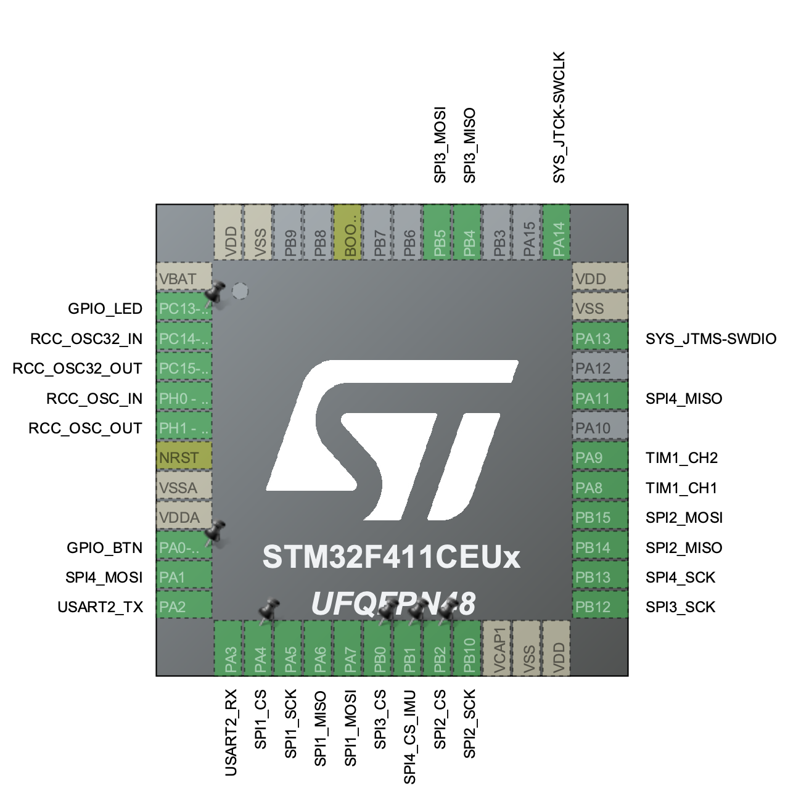

# Payload Core

Firmware for the rocket payload flight controller, responsible for fin actuation, flight data acquisition and logging.

## System Overview

The payload core can be run on the STM32F411Xe family of microcontrollers, though the configuration is designed for the smaller STM32F411CE variant, found on the blackpill.

The pin assignments, and system interface assignments are as follows:

| Component | Model | Interface | Description | Pins |
|-----------|-------|-----------|-------------|------|
| Fin Servos 1/2 | FS5106B-FB | PWM (TIM1_CH1/2) | Active fin control | CH1(PA8), CH2(PA9)
| SPI Flash | Various | SPI1 | Onboard storage for inflight logging | SCK(PA5), MISO(PA6), MOSI(PA7)
| SD Card | - | SPI2 | To facilitate data recovery | SCK(PB10), MISO(PB14), MOSI(PB15)
| Altimeter | BMP388 | SPI3 | Barometric pressure/altitude sensing | SCK(PB12), MISO(PB4), MOSI(PB5)
| IMU | LSM9DS1 | SPI4 | 6-DOF inertial measurement (Mag disabled) | SCK(PB13), MISO(PA11), MOSI(PA1)
| - | - | UART2 | Serial output | TX(PA2), RX(PA3)
| - | - | RCC | Onboard LSE/HSE | OSC32_IN(PC14), OSC32_OUT(PC15), OSC_IN(PH0), OSC_OUT(PH1)
| - | - | SWD | Serial Wire Debug port | SWCLK(PA14), SWDIO(PA13)


The pin configuration is set up as follows:



Additionally, for the pins setup as GPIO, the definitions are as follows:
| Pin | Peripheral | Direction |
|-----|------------|-----------|
| PB2 | SPI2 CS | Output |
| PA4 | SPI1 CS | Output |
| PB0 | SPI3 CS | Output |
| PB1 | SPI4 CS IMU | Output |
| PA0 | Onboard KEY | Input |
| PC13 | Onboard LED (Blackpill) | Output |

## Getting Started

### Prerequisites

- [PlatformIO](https://platformio.org/) (CLI Core or IDE)
- On Windows machines: [ST-Link drivers](https://www.st.com/en/development-tools/stsw-link009.html)

### Building

You can use the PlatformIO IDE GUI to build and flash this project.

If using PlatformIO Core:

```bash
# Build the project
pio run

# Build and upload
pio run --target upload
```

## Development
The project uses the STM32Cube HAL framework. Key configuration options are in `platformio.ini`.

Initialization functions were generated by STM32CubeMX. The project file for that is located in the repository root. Should one need to change initialization configs, copy and paste the differences rather than overwriting files.

### Adding Drivers

Place driver libraries in the `lib/` directory. Each library should have its own subdirectory with source files and headers, as such:
```
lib/
├── sensor123/
│   ├── sensor123.c
│   └── sensor123.h
└── motor456/
    ├── motor456.c
    └── motor456.h
```

### Clock Configuration

The system is configured to use the external oscillators (HSE/LSE) with the following configuration:
- **System Clock**: 100 MHz from PLL
- **RTC Clock**: 32.768 KHz direct from LSE
- **AHB/APB1/APB2/etc.**: All clocks @ 100 MHz, except APB1 Peripheral, which is 50 MHz
